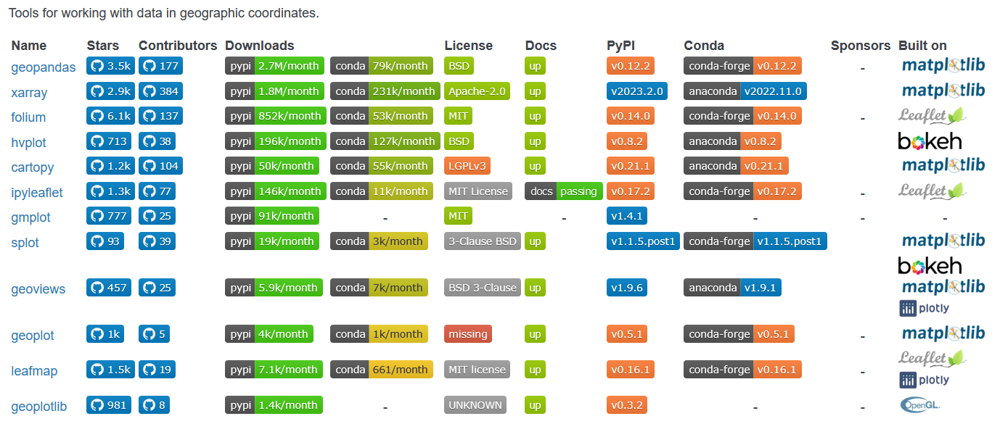

# Visualisation and geovisualisation

(Geo)visualisation with Python: what are the advantages?
- Can be automated (you are creating visualization scripts and not just visualizations!)
- Flexible: processes and designs can be extensively customized
- Interoperable: Integrates well with other more generic programming tools as well as mainstream GIS software
- Open Source: tools and resources are free and usually extensive, and there is a large support community
- Designs are arguably more extensive (but less consolidated and accessible than in GIS software)
- Can be used to generate both **static** and **interactive** visualisations

The goal of this overview is to help you situate yourself amid the growing constellation of (open source) geospatial tools so you can utilize those that best fit your needs.

There is a wealth of visualization libraries to choose from: the task of figuring out what's worth trying out and sticking to can be [quite overwhelming](https://www.mindomo.com/mindmap/the-python-visualisation-landscape-dark-fd1a5c3770bdf84be045094f15ed3b7a).

Visualisation libraries are largely based on two core technologies: Matplotlib and Javascript. When thinking about geovisualisation in particular:
- **Matplotlib** can be understood as the **core library for static maps** facilitated by extensions such as Geopandas, Cartopy, Geoplot, etc.
- **Bokeh** can be understood as a **core library for interactive maps**, since it generates the JavaScript code necessary for making interactive visualizations (which require a web browser to run).

# Static vs Interactive visualisations

- Static visualizations can be made of pixels (JPGs, PNGs, PDFs) or vectors (SVGs)
	- Interactive visualisations are (usually) made with JavaScript and utilize web browsers to run vector animations, to serve tilemaps and make information interactive.
- They are more portable (device-agnostic)
	- Interactive ones too, increasingly...
- Less computationally intensive (lightweight, static)
	- Requires a more complex network of technologies to run, sometimes with heavy processing.
- They require much more attention to design
	- Can lead to lazy design (more geoportals than actual maps!)

Below: static maps traditionally involve an intense attention to visual hierarchies and detail, such as in this topographic map of Michigan.

!(imgs/20230208135919.png)

!(imgs/20230208141417.png)
Above: A good example of a bivariate mapping [by Adriana Jacobsen](https://twitter.com/adrianaclimbs/status/1311714757083303937)

---
!("original_0dd817663030f7797c314bf2c9773ad6.jpg)
Above: a poster and map series that uses *small multiples* effectively: *"Small multiple designs, multivariate and data bountiful, answer directly by visually enforcing comparisons of changes, of the differences among objects, of the scope of alternatives. For a wide range of problems in data presentation, small multiples are the best design solution."* ([Tufte 1990](https://www.edwardtufte.com/tufte/books_ei?gclid=CjwKCAiArY2fBhB9EiwAWqHK6iHEb9Ax-bn-4II14PJtgxdHppJqWYbPf2WTkNk4zcbXsYbKS19CWRoCMrcQAvD_BwE))

---
Below: *"Ugh! The attack of the random jurisdictional unit centroid! Americans should be heartened that there are no COVID cases near their border with Ontario & QC \(link to map](https://www.arcgis.com/apps/dashboards/bda7594740fd40299423467b48e9ecf6)\] "* -- [Tweet by Renee Sieber](https://twitter.com/re_sieber/status/1243266531724800001). A good example of sloppy design, often apparent in interactive maps!
!(imgs/20230208135309.png)

Below: a more general example of a terrible classification scheme by the [Montreal Gazette](https://twitter.com/andyriga/status/1349378195993337858?s=20), which can plague all maps, but especially poorly implemented interactive ones!

!(imgs/20230208135703.png)

Below is another example that appears to have a NyTimes visualisation fit for interactive interpretation but published as a static map (which was then corrected, as pointed out by [Chad Skelton](https://twitter.com/chadskelton/status/1247569232058966016))

!(imgs/20230208140136.png)
!(imgs/20230208140142.png)

!(imgs/20230208142331.png)
Above: [Map of commuting patterns between Italian towns](https://observablehq.com/d/787c14fa356a7c25). Must this be interactive?

## Matplotlib

*Matplotlib is a comprehensive library for creating static, animated, and interactive visualizations in Python. Matplotlib makes easy things easy and hard things possible.*
-- [matplotlib.org](https://matplotlib.org/)

- Matplotlib is the go-to plotting library (more like a whole universe) for Python. Built with Numpy.
- It is the **core library** for basically all other static visualisation libraries in Python.
- It is a **low-level** plotting library, in that it allows for an immense amount of control over fine details. However, this means it can take a lot of code (and sifting through documentation) to write. Many visualisation libraries are built on top of matplotlib for more specific use cases.
- Pretty much anything that you may want to do regarding 2D plotting (and some 3D) can be done with Matplotlib.
- Within Matplotlib you have the Pyplot module, which is a high level API for producing common plot types (*plot, scatter, hist, bar, pie, boxplot, contours*). PyPlot allows you to use Matplotlib [like MATLAB](https://matplotlib.org/stable/api/index#the-implicit-api).
	- i.e. Pyplot accesses matplotlib classes more simply: e.g. `pyplot.figure()` will basically create a `matplotlib.axes.Axes` object

### Components of a graph

We can separate a graphic into three basic components ([Sharpnack 2018](https://anson.ucdavis.edu/~jsharpna/DSBook/unit1/visualization.html#grammar-of-graphics)):
- geometric objects (the data points and regression lines)
- scales and coordinate systems (guide lines and ticks);
- annotation for the plot (axis labels, etc.)

When we `plot()` something in matplotlib, we usually create the following:
- Figure: this contains everything that gets plotted; it has children axes, which can be subfigures, the title, and the details of how the plot is actually printed.
- Axes: this is where the individual plots live; it contains each axis and annotations.
- Artist: the geometric objects that are drawn on the plot.

!(imgs/20230208012830.png)
Source: Hubble, Edwin. “A relation between distance and radial velocity among extra-galactic nebulae.” Proceedings of the National Academy of Sciences 15.3 (1929): 168-173.

## Generic visualisation libraries built on Matplotlib

### [Seaborn](http://seaborn.pydata.org/index.html)
- Built on top of matplotlib, higher-level library means fewer lines of code for basic plots (many predefined plots).
- Prettier/more modern default styles/color palettes
- You’ll need to know matplotlib to tweak anything beyond the defaults

### [Plotnine](https://github.com/has2k1/plotnine)

- Python implementation of ggplot2 (R) and the [grammar of graphics](https://www.uvm.edu/~ngotelli/Rscripts/wickham.2009.pdf). Built on Matplotlib.
- The grammar \[of graphics\] allows users to compose plots by explicitly mapping data to the visual objects that make up the plot. Plotting with a grammar is powerful, it makes custom (and otherwise complex) plots easy to think about and then create, while the simple plots remain simple. ([from the docs](https://plotnine.readthedocs.io/en/stable/index.html))

## Geographical extensions of Matplotlib

## [Geopandas](https://geopandas.org/en/stable/index.html)

- A geographical extension to pandas, the most widely used dataframes package.
- Has [basic geographic plotting](https://geopandas.org/en/stable/docs/user_guide/mapping.html) capabilities, enough for any basic choropleth maps, for example.
- Since it depends on matplotlib, you can add all kinds of matplotlib elements to complete a map (annotations, labels, etc.)
- Can also generate static geovisualizations on an [interactive map](https://geopandas.org/en/stable/docs/user_guide/interactive_mapping.html) using folium (a package dependency). e.g. the geopandas explore() method returns a folium.Map object,

Below: A plot made with geopandas using folium, which uses leaflet to provide a tilelayer as a basemap and interactivity commonly seen in webmaps. Source: Geopandas documentation.

!(imgs/20230208011306.png)

## [Cartopy](https://github.com/SciTools/cartopy)

Especially useful for geovisualization of large areas (small scales). Uses PyProj (crs), Shapely (geoms) and Numpy, and builds off of matplotlib objects (figure, axes, etc.). 

Below: a globe series made with the cartopy package, which relies on cartopy especially for visualizations like these.
!(imgs/20230208011425.png)
source: https://residentmario.github.io/geoplot/gallery/plot_los_angeles_flights.html

## [Geoplot](https://residentmario.github.io/geoplot/index.html)

This package provides some additional functionality to the basic GeoDataFrames .plot() method. It's a high-level plotting tool (with more plot types than geopandas), like the Seaborn of mapping. Compatible with/Extends on matplotlib objects (figure, axes, etc.) and cartopy (dealing with projections, complex visualizations).

## Accessories and dependancies

- [contextily](https://github.com/darribas/contextily) can fetch tilemaps/basemaps found in webmaps and provide these as basemaps for your geographic plots. These are stored as a static background image which can also be written to disk as raster files.
- [mapclassify](https://github.com/pysal/mapclassify) implements classification schemes for choropleth maps.
- [folium](https://python-visualization.github.io/folium/) for plotting data within an interactive map interface using leaflet, an open source JS webmapping library. Geopandas ships with folium.
- [ipyleaflet](https://github.com/jupyter-widgets/ipyleaflet) like folium, but specifically for visualization within jupyter notebooks.
- [matplotlib-scalebar](https://pypi.org/project/matplotlib-scalebar/) (for adding a scalebar when plotting in pure Geopandas, not necessarily intended for use in making maps but it works!)

# Interactive geovisualisation

## [Bokeh](https://docs.bokeh.org/en/latest/)

- Made by Anaconda (makers of conda package management system), relies on the grammar of graphics. High level package.
- Strengths in interactive charts/data dashboards
- Use python to generate web-based javascript visualizations easily embeddable elsewhere. Bokeh utilizes Javascript under the hood.
- Bokeh is a bit like the matplotlib to interactive viz in Python: several other interactive visualisation packages are based on it!

## [Plotly](https://plotly.com/python/)

- Based in Montreal
- Private company that also publishes [open-source](https://plotly.com/python/is-plotly-free/) viz libraries
- Strengths in interactive charts especially when with their Dash data dashboards
- More involved (verbose) than other, but requires fewer lines of code than matplotlib!
- Utilizes some Javascript under the hood.

## [Vega-Altair](https://altair-viz.github.io/#)

Instead of Bokeh, it is based on [Vega](https://vega.github.io/vega/), a Javascript library that proposes its own grammar of graphics and is essentially an [API for D3](https://vega.github.io/vega/about/vega-and-d3/). Altair can be used to easily make static as well as interactive graphs and maps.

## [Datashader](https://datashader.org/#)

For efficiently plotting extremely large datasets. This is a library for plotting big data on your laptop and in jupyter (imported into a pandas dataframe). Documentation is so-so.

Below: 300 000 000 points (1 per person) plotted using datashader

!(imgs/20230208023713.png)

## [Geoviews](http://geoviews.org/)

Builds off of cartopy to produce both static (Matplotlib) and interactive (Bokeh) visualisations. Can also integrate Datashader. Used especially by those in the environmental sciences.

## [HVPlot](https://github.com/holoviz/hvplot)

Basically a catch-all library that can pump out visualizations in matplotlib, Bokeh or plotly, sourcing from datashader, cartopy, etc.

---

Below: Demonstration of GeoViews + datashader + Bokeh by [Gregor Herda](https://gregorhd.github.io/): *Building footprints are being rasterised by datashader on-the-fly at ever higher resolutions as you zoom in while preserving the ability to interactively access the polygons’ attributes via the hover tool.*

## [PyDeck](https://deckgl.readthedocs.io/en/latest/index.html)

FInally, there is also **PyDeck**, which are a set of Python bindings for Deck.GL (Uber's open source visualization library), which is an exciting library that mobilizes WebGL (a JavaScript API) to render [large datasets interactively](https://deckgl.readthedocs.io/en/latest/gallery/hexagon_layer.html). Uses Javascript under the hood!

> *Under the hood, pydeck converts its Python objects to JSON and passes that JSON to the new @deck.gl/json API. This library interprets JSON objects into deck.gl layers, letting users render a visualization written in Javascript without having to know Javascript itself. Pydeck augments this by also providing components for Jupyter Notebook integration and convenience functions for data processing. ([Duberstein 2019](https://medium.com/vis-gl/pydeck-unlocking-deck-gl-for-use-in-python-ce891532f986))

